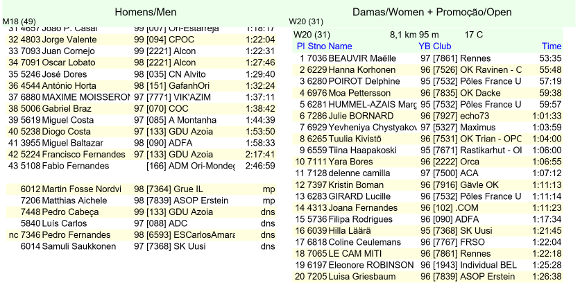

<!-- View this file with a Markdown editor (eg: http://markdownedit.com) -->
# Show Orienteering Results

## Fork modifications
below.

## What it is
Web page to show orienteering results from [OE2010][OE2010] to the public.

The results are shown in a typical web page and then scrolled automatically until the end of the page. When the end of the page is reached the results are refreshed, and we start again at the top.

There are two columns with results. This way we can cycle the results twice as fast. The idea would be to show for example men on the left and women on the right.

Here you can see a sample output:

This page only works for results generated by the OE2010 software. If you use a different software, this system will not work out of the box. This is because it uses specific layout details of the result window that are only present in OE2010.

If you want to use it, you will have to understand how the system works and adapt it to the layout of the results sheet generated by your software. If you need help, please to not hesitate to contact [me][rui]. I will try to see if it is even possible.

## Set Up
The idea behind this system is to have a portable computer, that handles the results, connected to one or more big screens that will show the results to the public.

The big screens can be big TV monitors, or even some overhead projectors. If the computer can handle more than one screen, then you can use them all. Alternatively you can use VGA/HDMI splitters and connect more TVs to the same output. This way you will have the same image on the TVs. But if placed carefully you can give a better service to the public.

This computer will also have to be connected to the event network, so that it can get the latest results.

For an even better solution, you can have several computers showing the results. Just replicate this solution in each computer and choose different categories to show in each of them.

## Usage
Just load the page `OriResults.html` in the browser. The page will do the rest of the work without any user intervention. It will only be necessary to keep refreshing the results from an external source (normally the event manager software). 

The page will load file `res1.html` for the left column and `res2.html` for the right column. These pages should be generated using the OE2010 software. Please see the file [Instructions.md] for instructions on how to generate these files.

For better results, the browser window should be maximized and in full page view (press F11 in most browsers).

## Problems
This page uses `IFrames` to include the results pages. This can cause security issues with some browsers.

For now it works fine in Internet Explorer 11 and Firefox 58. But it does not work in Chrome 46 or above.

## Installation
No installation necessary. Just copy the files to any folder you want. You can erase the `samples` folder.

## Configuration
Here are the things that need to be done once you have all the hardware setup. This is necessary since the resolution of the display will differ, and also their ability to display all the information.

All of these configurations are done in the `OriResults.html` file. Look for the string `CUSTOMIZE HERE` to locate them. They are presented here in the same order that they appear in the file.

### Page margin
Some TVs might cut a little of the page on the left and on the right of the screen. To account for this, set the margin of the `body` tag on the CSS style at the top of the page. If the TV does not cut anything, then set it to 0. You will have more place to show the results.

### Column titles
You should set the column titles to say what classes are shown on the respective column.

The titles are inside `div` tags right at the start of the `body`. The first title is for the left column and the second for the right.

### Timings
If you prefer to use a different speed to show the results, change the values at the start of the JavaScript code (the unit of time is milliseconds).

    scrollBaseTime - minimum time for scroll
    scrollLineTime - scroll time per line
    stopTime - time to wait when the scrolling stops

Basically the scrolling time is calculated by:

    scrollBaseTime + <numer of lines> * scrollLineTime
    
After the scrolling is finished, it waits for `stopTime` milliseconds before the scrolling starts again.
  
Play around with them until you achieve the result you want. All values are possible.

### Font size
The font size must be defined by this page, since OE2010 does not take it into account.

Go to the function `prepareIFrame`, locate the lines that change the font and put the values you want. In principle you should choose the biggest size that still shows the whole text in the columns.

### OE2010 results export
The files `res1.html` and `res2.html` are the files with the results that are shown on the page. You cannot customize them here. They can only be customized in the OE2010 software itself. Please see the file [Instructions.md] for further instructions.

## Dependencies
Uses JQuery 2.1.4.

## Authors
Developed by [Rui Botão][rui].

## Licensing
MIT. See [License][License].

## Bibliography
[JQuery][jquery].

   
Written by [Rui Botão][rui]. 
Feb 2018

[rui]: mailto:rui@ruibotao.com "Rui"
[jquery]: http://jquery.com/  "JQuery"
[OE2010]: http://www.sportsoftware.de/ "OE2010"
[Instructions.md]: Instructions.md "Instructions"
[License]: LICENSE "License"
